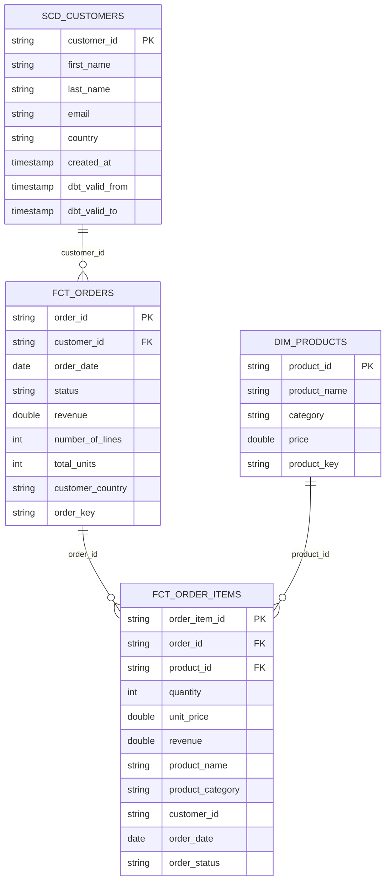
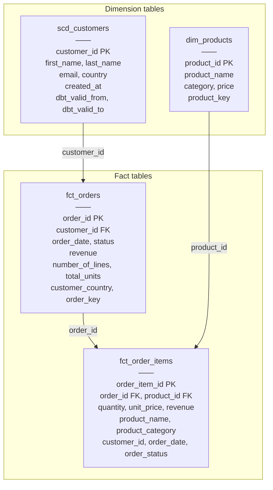
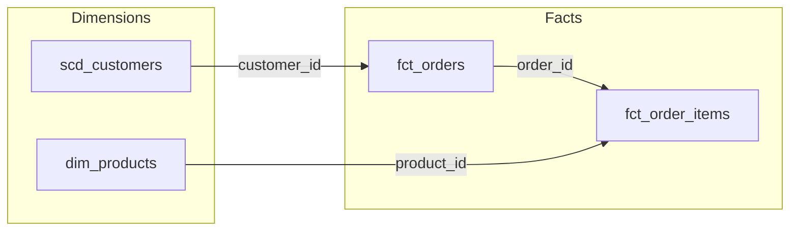

# Star Schema

---

## 1. Star schema — ER diagram (tables + columns)

```mermaid
erDiagram
    SCD_CUSTOMERS ||--o{ FCT_ORDERS : "customer_id"
    FCT_ORDERS ||--o{ FCT_ORDER_ITEMS : "order_id"
    DIM_PRODUCTS ||--o{ FCT_ORDER_ITEMS : "product_id"

    FCT_ORDERS {
        string order_id PK
        string customer_id FK
        date order_date
        string status
        double revenue
        int number_of_lines
        int total_units
        string customer_country
        string order_key
    }

    FCT_ORDER_ITEMS {
        string order_item_id PK
        string order_id FK
        string product_id FK
        int quantity
        double unit_price
        double revenue
        string product_name
        string product_category
        string customer_id
        date order_date
        string order_status
    }

    SCD_CUSTOMERS {
        string customer_id PK
        string first_name
        string last_name
        string email
        string country
        timestamp created_at
        timestamp dbt_valid_from
        timestamp dbt_valid_to
    }

    DIM_PRODUCTS {
        string product_id PK
        string product_name
        string category
        double price
        string product_key
    }
```

---

## 2. Star schema — Fact vs Dimension (with columns)

```mermaid
flowchart TB
    subgraph Dimensions["Dimension tables"]
        SCD["scd_customers<br/>——<br/>customer_id PK<br/>first_name, last_name<br/>email, country<br/>created_at<br/>dbt_valid_from, dbt_valid_to"]
        DIM["dim_products<br/>——<br/>product_id PK<br/>product_name<br/>category, price<br/>product_key"]
    end

    subgraph Facts["Fact tables"]
        FCT_O["fct_orders<br/>——<br/>order_id PK<br/>customer_id FK<br/>order_date, status<br/>revenue<br/>number_of_lines, total_units<br/>customer_country, order_key"]
        FCT_I["fct_order_items<br/>——<br/>order_item_id PK<br/>order_id FK, product_id FK<br/>quantity, unit_price, revenue<br/>product_name, product_category<br/>customer_id, order_date, order_status"]
    end

    SCD -->|customer_id| FCT_O
    FCT_O -->|order_id| FCT_I
    DIM -->|product_id| FCT_I
```

---

## 3. Simple star (facts in the middle)

```mermaid
flowchart LR
    subgraph Dim["Dimensions"]
        SCD[scd_customers]
        DIM[dim_products]
    end

    subgraph Fact["Facts"]
        FCT_O[fct_orders]
        FCT_I[fct_order_items]
    end

    SCD -->|customer_id| FCT_O
    FCT_O -->|order_id| FCT_I
    DIM -->|product_id| FCT_I
```

